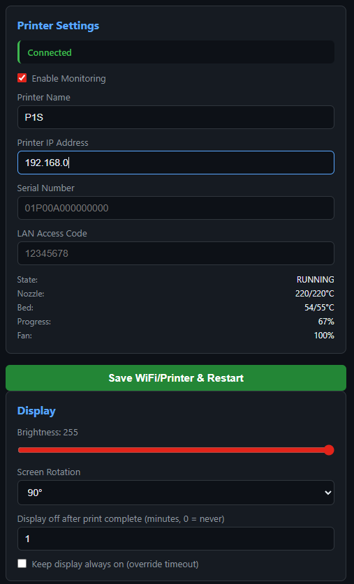
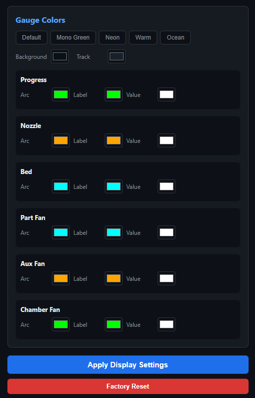
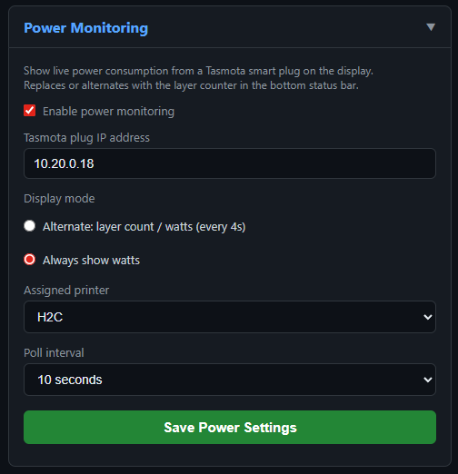

# BambuHelper WisBlock

----

_**This fork is for WisBlock RAK3312 ESP32-S3 with RAK14014 240x320 px TFT touch screen display.**_     
_**It is updated frequently with updates made on the original code provided by @keralots**_     

----

Dedicated Bambu Lab printer monitor built with RAK3312 ESP32-S3 and the RAK14014 2.4" 240x320 color TFT display (ST7789) with FT6336U Touch Screen.

Connects to your printer via MQTT over TLS and displays a real-time dashboard with arc gauges, animations, live stats, and optional buzzer notifications.

For additional supported boards, please check [@Keralots BambuHelper repo](https://github.com/Keralots/BambuHelper).

> **One-click setup:** as of v3.2, you can flash your board and configure WiFi entirely from the browser at **[keralots.github.io/BambuHelper](https://keralots.github.io/BambuHelper/)** - no PlatformIO, no esptool, no captive portal hopping.

### Supported Printers

| Connection Mode | Printers | How it connects |
|---|---|---|
| **LAN Direct** | P1P, P1S, X1, X1C, X1E, A1, A1 Mini | Local MQTT via printer IP + LAN access code |
| **LAN Direct (Developer Mode)** | H2S, H2C, H2D | LAN-only mode + Developer Mode required - see note below |
| **Bambu Cloud (All printers)** | Any Bambu printer | Cloud MQTT via access token - no LAN mode needed |

> **H2 series LAN mode:** H2S, H2C, and H2D printers require both **LAN-only mode** and **Developer Mode** enabled in printer settings for local MQTT to work. Without Developer Mode, the printer accepts connections but does not respond to status requests. If you prefer not to enable Developer Mode, use Bambu Cloud mode instead.

> **Tip:** Use "Bambu Cloud (All printers)" if you don't want to enable LAN/Developer mode on your printer (for example to keep Bambu Handy working), if your ESP32 is on a different network than the printer, or if your printer only supports cloud mode (P2S).

### Cloud Mode Security Notice

When using Bambu Cloud, BambuHelper connects through Bambu Lab's cloud MQTT service. Here is what you need to know:

- **No credentials are stored** - BambuHelper never asks for your email or password. You extract an access token from your browser and paste it into the web interface.
- **Only the access token is stored** in the ESP32's flash memory. This token expires after about 3 months, at which point you simply paste a new one.
- **Read-only access** - BambuHelper only reads printer status. It never sends commands or modifies printer settings.
- **Same approach as other community projects** - this is the same authentication method used by the [Home Assistant Bambu Lab integration](https://github.com/greghesp/ha-bambulab), [OctoPrint-Bambu](https://github.com/jneilliii/OctoPrint-BambuPrinter), and other trusted third-party tools.

## Screenshots

| Dashboard | Web Interface - Settings | Web Interface - Gauge Colors |
|---|---|---|
|  |  |  |

## Supported Boards

| Preview | Board | Notes |
|--------------------------------------|-------|-------|
|  | **WisBlock RAK3312 ESP32-S3 + RAK14014 Touch LCD** | `240x320` ST7789 version with ESP32-S3, built with WisBlock Modular System. No soldering required, all components are just plugged together. Use the `rak3312` firmware build. Supports **up to 2 printers**, like the main ESP32-S3 DIY version. See [WisBlock Modular System components](#wisblock-modular-system-components) for used modules. Matching enclosure on [MakerWorld](https://makerworld.com/en/models/2571194-wisblock-bambuhelper-landscape) and [Instructables](https://www.printables.com/model/1649739-wisblock-bambuhelper-landscape) |

Check [@Keralots BambuHelper repo](https://github.com/Keralots/BambuHelper) for other supported MCU/Display options

## Features

- **One-click web flasher** - install firmware directly from [keralots.github.io/BambuHelper](https://keralots.github.io/BambuHelper/) in desktop Chrome/Edge - no PlatformIO, no esptool, no flash offsets
- **In-browser WiFi setup (Improv-Serial)** - on first boot the install dialog asks for your WiFi over USB; no captive-portal switching needed (AP fallback still available)
- **Live dashboard** - progress arc, temperature gauges, fan speed, layer count, time remaining
- **H2-style LED progress bar** - full-width glowing bar inspired by Bambu H2 series
- **Anti-aliased arc gauges** - smooth nozzle and bed temperature arcs with color zones
- **AMS visualization** - per-tray colors, drying status, plus an optional bottom-row strip view on 240x240 screens, configurable per printer
- **Tasmota power monitoring** - per-printer smart plug with live wattage, per-print kWh + cost, and optional auto-off after print finishes (with hot-end gate)
- **Animations** - loading spinner, progress pulse, completion celebration
- **Web config portal** - dark-themed settings page for WiFi, network, printer, display, power, buzzer, and LED settings
- **Network configuration** - DHCP or static IP, with optional IP display at startup
- **Display auto-off** - configurable timeout after print completion, auto-off when printer is off
- **NVS persistence** - all settings survive reboots
- **Auto AP mode** - creates WiFi hotspot on first boot or when WiFi is lost
- **Smart redraw** - only redraws changed UI elements for smooth performance
- **Customizable gauge colors** - per-gauge arc/label/value colors with preset themes
- **Multi-printer support** - monitor up to 2 printers simultaneously on full-RAM boards (ESP32-S3 family); CYD, TZT, and ESP32-C3 have an experimental opt-in 2-printer mode but default to 1 printer
- **Smart rotation** - automatically shows the printing printer; cycles between both when both are printing
- **Physical button / touchscreen** - cycle printers and wake display via optional push button or TTP223, board-built-in buttons (Waveshare 1.54"), or the built-in capacitive touchscreens on CYD / TZT / Waveshare 2" / Waveshare 1.54"
- **Optional LED** - PWM-driven status LED on a user-configurable pin; hold the button/touch to dim
- **Optional buzzer** - passive buzzer notifications for print finished, connected, and error events; Waveshare 1.54" uses its built-in ES8311 audio codec instead
- **OTA updates** - update firmware from the device's web interface (manual upload or one-click from GitHub Releases)
- **Battery support (Waveshare 2" and 1.54")** - on-screen battery indicator, charging detection, hold-to-power-off
- **Exponential backoff** - reconnect attempts to offline printers gradually slow down to conserve resources

## Hardware

| Component Wisblock | Specification |
|---|---|
| MCU | [RAK3312](https://store.rakwireless.com/products/wisblock-core-module-rak3312-lora-wifi-ble) ESP32-S3 |
| Base Board | [RAK19007](https://store.rakwireless.com/products/rak19007-wisblock-base-board-2nd-gen) Base Board |
| Display | [RAK14014](https://store.rakwireless.com/products/240x320-pixel-full-color-tft-display-with-touch-screen-rak14014) 320x240 2.4" TFT Touch Screen display |
| Buzzer | [RAK18001](https://store.rakwireless.com/products/wisblock-buzzer-module-rak18001) Buzzer |
### Default Wiring

> **Note:** WisBlock RAK3312" is a modular concepts with the display already integrated. No additional wiring or soldering is required.     

### Optional Touch Sensor / Button Wiring

> **Note:** For WisBlock RAK3312 with RAK14014 TFT display select **TouchScreen** in the web interface.

### Optional Buzzer Wiring

Optional a [WisBlock RAK18001 Buzzer](https://store.rakwireless.com/products/wisblock-buzzer-module-rak18001) can be added in Sensor Slot A of the WisBlock Base Board.     
The buzzer is completely optional. If you do not connect one, BambuHelper works normally.

> **Note:** For WisBlock RAK3312 with RAK14014 TFT display and the RAK18001 buzzer, the GPIO pin is `GPIO 21`.

> **WARNING:** Due to the high current peak of the buzzer, it requires to use a battery connected to the WisBlock Base Board. Otherwise the ESP32-S3 might trigger a power failure and reboots.

### Assembly Instructions

[Assembly Guide](./img/WisBlock_BambuHelper_assembly_guide_for_landscape_enclosure_version.pdf)

### WisBlock Modular System components

| Component Wisblock | Specification |
|---|---|
| MCU | [RAK3312](https://store.rakwireless.com/products/wisblock-core-module-rak3312-lora-wifi-ble) ESP32-S3 |
| Base Board | [RAK19007](https://store.rakwireless.com/products/rak19007-wisblock-base-board-2nd-gen) Base Board |
| Display | [RAK14014](https://store.rakwireless.com/products/240x320-pixel-full-color-tft-display-with-touch-screen-rak14014) 320x240 2.4" TFT Touch Screen display |
| Buzzer | [RAK18001](https://store.rakwireless.com/products/wisblock-buzzer-module-rak18001) Buzzer |

## Flashing

1. Download the latest firmware from [Releases](../../releases). **If you are flashing a new device for the first time**, use the file ending with **-Full** (for example `BambuHelper-esp32s3-v2.7-Full.bin`). The regular `-ota.bin` file is for OTA updates on devices that already have BambuHelper installed.
2. Open [ESP Web Flasher](https://espressif.github.io/esptool-js/) in Chrome or Edge
3. If you are flashing a **CYD** or **TZT L1435-2.4**, set **Baudrate** to **115200** before clicking **Connect**. Two or more attempts may be needed - the first one will fail. This applies to both CYD-shaped boards (they use a CH340 USB-Serial chip that does not tolerate high baud rates on first contact).
4. Connect your ESP32 via USB
5. Click **Connect** and select your device
6. Set flash address to **0x0**
7. Select the downloaded `.bin` file
8. Click **Program**

### Updating an Existing Device (OTA)

Once you have BambuHelper running, you do not need to re-flash over USB to update. From the device's web interface:

1. Open the device's IP in a browser
2. Scroll to **Other** -> **OTA Update**
3. Click **Check for updates** - the device queries GitHub Releases and, if a newer build is available, shows a one-click **Install Update** button that pulls the matching `*-ota.bin` straight from the release
4. If you prefer to upload manually (e.g. a custom build), the same panel accepts a local `*-ota.bin` file via drag-and-drop

The device reboots automatically once the update is written; the web page reloads when it comes back online.

### Build Files

| Board | Use this `Full` file for first flash / recovery |
|---|---|
| WisBlock RAK3312 | `BambuHelper-rak3312-vx.y-Full.bin` |
| Other ESP32 Boards | Check [@Keralots BambuHelper repo](https://github.com/Keralots/BambuHelper) |

## Setup

### Configuration Guide

[](https://youtu.be/n2RdbeHTMz0) 

> **If you used the web flasher**, steps 2-4 happen automatically in the install dialog (Configure WiFi step). The device joins your home WiFi straight away and the dialog gives you a link to its IP - jump to step 5. The AP captive-portal path below is the fallback when you skipped or timed out of the Configure WiFi dialog, or when you flashed via the generic ESP Web Flasher.

1. **Flash** the firmware (see above)
2. **Connect** to the `BambuHelper-XXXX` WiFi network (password: `bambu1234`)
3. **Open** `192.168.4.1` in your browser
4. **Enter** your home WiFi credentials and **Save** - the device restarts and connects to your WiFi
5. **Note the IP address** shown on the ESP32 display after it connects to WiFi
6. **Open** that IP address in your browser to access the full web interface
7. **Configure your printer:**

   **LAN Direct** (P1P, P1S, X1, X1C, X1E, A1, A1 Mini):
   - Printer IP address (found in printer Settings > Network)
   - Serial number (see note below)
   - LAN access code (8 characters, from printer Settings > Network)

   **Bambu Cloud (All printers)**:
   - Get your Bambu Cloud access token from your browser (see [Getting a Cloud Token](#getting-a-cloud-token) below)
   - Paste the token into the web interface
   - Enter your printer's serial number (see note below)

   > **Important: Serial number is NOT the printer name.** The serial number is a 15-character code (for example `01P00A000000000`) found on the printer LCD under **Settings > Device > Serial Number**, or on the physical label on the back or bottom of the printer. Do not confuse it with the printer name shown in Bambu Studio (for example `3DP-01P-110`), which is a shortened version and will not work.

8. **Save Printer Settings** - the device connects to your printer

### Getting a Cloud Token

To use cloud mode, you need an access token from your Bambu Lab account. The easiest way is to copy it from your browser cookies on https://bambulab.com (you must be logged in).

**Using browser DevTools (Chrome / Edge):**
1. Open https://bambulab.com and log in to your account
2. Press **F12** to open DevTools
3. Go to the **Application** tab (click `>>` if you do not see it)
4. In the left sidebar, expand **Cookies** -> click `https://bambulab.com`
5. Find the row named `token` in the cookie list
6. Double-click the **Value** cell to select it, then **Ctrl+C** to copy
7. Paste the value into BambuHelper's "Access Token" field in the web interface

**Using browser DevTools (Firefox):**
1. Open https://bambulab.com and log in to your account
2. Press **F12** to open DevTools
3. Go to the **Storage** tab
4. In the left sidebar, expand **Cookies** -> click `https://bambulab.com`
5. Find the row named `token`
6. Double-click the **Value** cell to select it, then **Ctrl+C** to copy
7. Paste the value into BambuHelper's "Access Token" field

**Using browser DevTools (Safari):**
1. Open https://bambulab.com and log in to your account
2. Open **Develop** -> **Show Web Inspector** (enable the Develop menu first in Safari Preferences -> Advanced)
3. Go to the **Storage** tab -> **Cookies** -> `bambulab.com`
4. Find and copy the `token` value
5. Paste it into BambuHelper's "Access Token" field

> **Note:** The token is valid for approximately 3 months. When it expires, the ESP32 will fail to connect - simply repeat the process above to get a fresh token and paste it in the web interface. Make sure to select the correct **Server Region** (US/EU/CN) to match your Bambu account's region.

**Optional: Companion Tool for one-click setup**

If you'd rather skip the copy-paste flow entirely, the [Companion Tool](tools/DIAGNOSTICS-HOWTO.md) (`tools/BambuHelper-CompanionTool.exe` on Windows, `python tools/bambu_diag.py` on Mac/Linux) logs into your Bambu account, fetches your printer list, and pushes the token + serial straight to BambuHelper over your LAN - no copying, no pasting. Pick "Configure BambuHelper device" from its menu.

> **Browser cookie token expires very quickly (after one session, on next reboot, etc.)?** Try the Companion Tool instead - tokens obtained that way tend to be more stable than browser cookies that get invalidated unexpectedly soon after extraction.

### Custom Smooth Fonts

BambuHelper embeds smooth fonts directly in the firmware as VLW tables in `PROGMEM`. The default font is **Inter** (Regular for small/body, Bold for large headings), shipped as TTF in `fonts/` and pre-converted to C headers in `include/fonts/`. Swapping the font means regenerating those headers and reflashing - there is no runtime upload, because the font lives in flash next to the code.

Steps:

1. Drop your `.ttf` files into `fonts/` (e.g. `MyFont-Regular.ttf`, `MyFont-Bold.ttf`).
2. Edit the `FONTS` list in [`scripts/generate_vlw_fonts.py`](scripts/generate_vlw_fonts.py) - each entry is `(output_name, ttf_filename, pixel_size)`. Keep the three names `inter_10`, `inter_14`, `inter_19` unless you also rename the includes in `src/fonts.cpp`.
3. Install the converter dependency once: `pip install freetype-py`.
4. Regenerate the headers:
```bash
   python scripts/generate_vlw_fonts.py
```
5. Rebuild the firmware for your target:
   ```bash
   pio.exe run -e cyd
   ```
6. Flash the new `.pio/build/<env>/firmware.bin` over USB or push it OTA via the web UI's firmware update page.

Tips:

- Pick a font that renders well at small pixel sizes - thin or highly stylised faces will look smudged at 10-14 px. Sans-serif faces designed for UI work best.
- Each VLW table grows roughly linearly with pixel size; the default Inter set is ~37 KiB total. Watch the flash usage line at the end of the build if you push to bigger sizes.
- Only printable ASCII (0x20-0x7E) and the degree symbol (0xB0) are baked in. Add codepoints by editing `CHARSET` in the generator.

## Web Interface

The built-in web interface (accessible at the device's IP address) provides the following settings:

### WiFi Settings
- **SSID** - your home WiFi network name
- **Password** - WiFi password

### Network
- **IP Assignment** - choose between DHCP (automatic) or Static IP
- **Static IP fields** (when static is selected):
  - IP Address
  - Gateway
  - Subnet Mask
  - DNS Server
- **Show IP at startup** - display the assigned IP on screen for 1.5 seconds after WiFi connects (on by default)

### Printer Settings
- **Connection Mode** - LAN Direct or Bambu Cloud (All printers)
- **LAN mode fields:**
  - Printer Name, Printer IP Address, Serial Number, LAN Access Code
- **Cloud mode fields:**
  - Server Region (US/EU/CN), Access Token, Printer Serial Number, Printer Name
- **Live Stats** - real-time nozzle/bed temp, progress, fan speed, and connection status

### Display
- **Brightness** - backlight level (10-255)
- **Screen Rotation** - 0, 90, 180, 270 degrees
- **Display off after print complete** - minutes to show the finish screen before turning off the display (0 = never turn off, default: 3 minutes)
- **Keep display always on** - override the timeout and never turn off
- **Show clock after print** - display a digital clock with date instead of turning off the screen (enabled by default)

### Gauge Colors
- **Theme presets** - Default, Mono Green, Neon, Warm, Ocean
- **Background color** - display background
- **Track color** - inactive arc background
- **Per-gauge colors** (arc, label, value) for:
  - Progress
  - Nozzle temperature
  - Bed temperature
  - Part fan
  - Aux fan
  - Chamber fan

### Buzzer
- **Buzzer (optional)** - enable or disable passive buzzer notifications
- **GPIO Pin** - choose which ESP32 pin drives the buzzer (GPIO21 for WisBlock RAK18001 in Slot A)
- **Quiet Hours** - disable buzzer sounds during selected hours
- **Test Buttons** - quickly test available buzzer sounds from the web interface

### Other
- **Factory Reset** - erases all settings and restarts
- **OTA Update** - update firmware directly from the web interface

## Dashboard Screens

| Screen | When |
|---|---|
| Splash | Boot (2 seconds) |
| AP Mode | First boot / no WiFi configured |
| Connecting WiFi | Attempting WiFi connection |
| WiFi Connected | Shows IP for 1.5 seconds (if enabled) |
| Connecting Printer | WiFi connected, waiting for MQTT |
| Idle | Connected, printer not printing |
| Printing | Active print with full dashboard |
| Finished | Print complete with animation (auto-off after timeout) |
| Clock | After finish timeout (if enabled) - shows digital clock with date |
| Display Off | After finish timeout (if clock disabled) or printer powered off |

## Display Power Management

The display is managed from the **Display** section of the web interface (see above for the full list of fields). In short:

- After a print completes, the finish screen is shown for the configured number of minutes (default 3), then either a digital clock takes over or the display turns off.
- When the printer goes offline (powered off or disconnected), the display stays in whatever state it was in - it does not flicker back to the connecting screen.
- When the printer comes back online or starts a new print, the display wakes automatically.
- **Keep display always on** overrides the auto-off behaviour.
- **Show clock after print** (default on) chooses clock-over-off when the finish timer expires.

## Requirements

- For flashing: a desktop browser (Chrome or Edge) is enough - use the [web flasher](https://keralots.github.io/BambuHelper/). [PlatformIO](https://platformio.org/) is only needed if you want to modify the firmware yourself.
- **LAN mode:** Bambu Lab printer with LAN mode enabled, printer and ESP32 on the same local network
- **Cloud mode:** Bambu Lab account, ESP32 with internet access

## Multi-Printer Monitoring

BambuHelper supports monitoring up to 2 printers simultaneously via dual MQTT connections.

> **Low-RAM boards default to 1 printer.** Each MQTT connection takes ~85 KB of heap (TLS session + message buffer). The full-RAM boards (esp32s3, esp32s3_zero, ws_lcd_200, ws_lcd_154, sensecap_indicator) run two printers comfortably. The low-RAM boards (**CYD**, **TZT L1435-2.4**, **ESP32-C3**) ship with a single printer slot by default, but expose an **experimental opt-in 2-printer mode** in **Printer Settings** - try it if you really need two, but expect tighter memory and the occasional disconnect under load.

### Rotation Modes

| Mode | Behavior |
|---|---|
| **Smart** (default) | Shows the printing printer. If both are printing, cycles between them. If neither is printing, shows last active. |
| **Auto-rotate** | Cycles through all connected printers at a configurable interval (10s - 10min). |
| **Off** | Manually switch between printers using the physical button only. |

### Physical Button

The version with RAK3312 and RAK14014 TFT display does not require a physical button, as it has a touch screen.      
Select **Touchscreen** in the WebUI in _Hardware & Multi-Printer_ section.

### MQTT Reconnect Backoff

When a printer is physically powered off, BambuHelper uses exponential backoff to avoid wasting resources on repeated connection attempts:

| Phase | Attempts | Interval |
|---|---|---|
| Normal | First 5 | Every 10 seconds |
| Phase 2 | Next 10 | Every 60 seconds |
| Phase 3 | Beyond 15 | Every 120 seconds |

When the printer comes back online, the backoff resets to normal immediately.

## Power Monitoring

| | |
|---|---|
|  | BambuHelper can display live power consumption from a **[Tasmota](https://tasmota.github.io/docs/)-flashed smart plug** connected to your printer. Tasmota is open-source firmware for ESP-based smart plugs that exposes a local HTTP API and MQTT - no cloud required.<br><br>**What it shows:**<br>- Live wattage in the bottom status bar on the idle and printing screens<br>- Total kWh used during the print job, shown on the "Print Complete" screen<br><br>**Setup:** open the web interface, go to **Power Monitoring**, enter the plug's local IP address, set your preferred poll interval (10-30s), and choose whether to alternate the watts display with the layer counter or always show watts.<br><br>**Requirements:** any Tasmota-flashed smart plug with energy monitoring (e.g. Sonoff S31, BlitzWolf BW-SHP6, Nous A1). The plug must be on your local network and reachable from the ESP32. No Tasmota MQTT broker needed - BambuHelper polls the HTTP API directly.<br><br>**Auto power-off:** each plug can power itself off N minutes (1-240) after the print finishes, with a 50&nbsp;°C nozzle gate so it never triggers while the hot end is hot. Configure under **Power Monitoring -> Auto-off**. |

## Troubleshooting

### WiFi won't connect / drops frequently

**Antenna is not connected to MHF-4 connector of the RAK3312**    
Make sure the WiFi antenna that is coming with the RAK3312 is connected to the correct antenna connector on the RAK3312.e ESP32 module.

**Symptoms:**
- "Connecting to WiFi" screen appears briefly, then falls back to AP mode
- WiFi connects sometimes but drops after a few seconds
- Works fine when display is disconnected

### Printer shows "Connecting" but never connects

- **LAN Direct:** Make sure the printer and ESP32 are on the same network. Check that LAN mode is enabled on the printer and the access code is correct.
- **Bambu Cloud:** Verify the access token has not expired (about 3 months validity). Re-extract it from your browser and paste it again. Check the server region matches your Bambu account.
- If a printer is physically powered off, reconnect attempts will gradually slow down (backoff). It will reconnect automatically when the printer comes back online.

### Display shows wrong printer / does not switch

- Check rotation mode in the web interface (Multi-Printer section). Smart mode only switches automatically when a printer is actively printing.
- Press the physical button (if configured) to manually cycle between printers.

## Future Plans

- Keep updated with new features added by @keralots

## License

MIT
